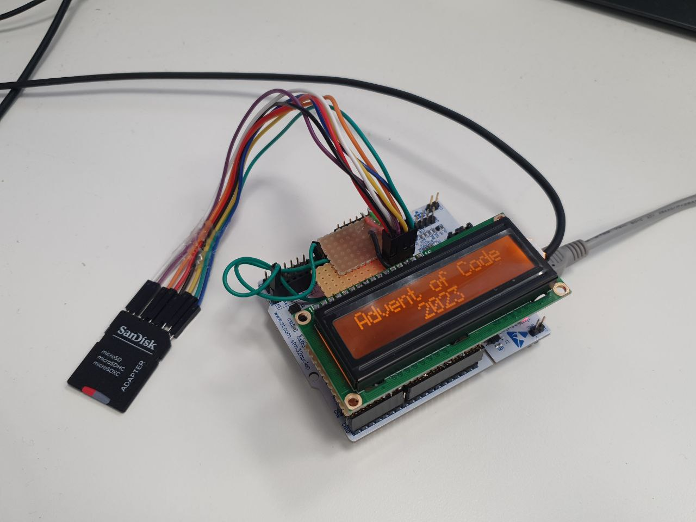

### Advent of Code 2023

AOC 2023 done using STM32F401 and C language.

### Hardware used:
- STM Nucleo-F401RE
- HD44780 compatible character display
- SD-card connected to SDIO-bus
- USB-C port connected to STM32 PA11 and PA12 pins.

